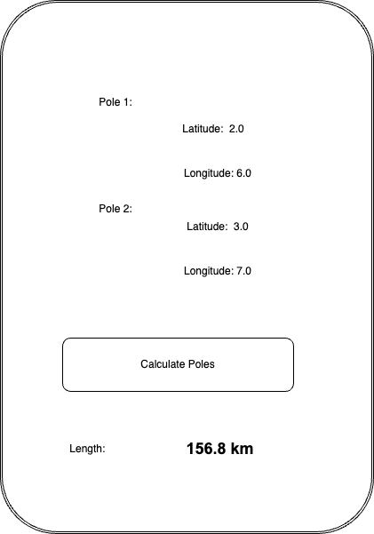

# React Native Code Challenge
## Instructions for completing this code challenge:
- Start by creating a fork of this repo and adding the required code for this prompt.
- Use the latest version of react native or the version indicated by the tutorials on the react native site to build your app.
- Create a pull-request for this work.
- Notify your contact at Quanta for getting your submission graded.

# MeasureUtilityPole Mobile App

You are a utility pole collector and your foreman has asked you to build a mobile application that calculates the distance between 2 utility poles.

The mobile application functions as follows:

- When the user opens the app, the application displays a calculate distance tool as you will see in the mockups below.

### Pole Distance Calculator
This view should read from a set of inputs and display the pole data in a list format.  Build your program according to the mockup below.

- Assume that when the user has not entered a value, the length label displays 0.0 km.

Sample Mockup (after user clicks calculate poles):



# Required Formulas 

Use the following functions for calculating the distance between two latitudes and longitudes:

``` javascript
   //This function takes in latitude and longitude of two location and returns the distance between them as the crow flies (in km)
    function calcCrow(lat1, lon1, lat2, lon2) 
    {
      var R = 6371; // km
      var dLat = toRad(lat2-lat1);
      var dLon = toRad(lon2-lon1);
      var lat1 = toRad(lat1);
      var lat2 = toRad(lat2);

      var a = Math.sin(dLat/2) * Math.sin(dLat/2) +
        Math.sin(dLon/2) * Math.sin(dLon/2) * Math.cos(lat1) * Math.cos(lat2); 
      var c = 2 * Math.atan2(Math.sqrt(a), Math.sqrt(1-a)); 
      var d = R * c;
      return d;
    }

    // Converts numeric degrees to radians
    function toRad(Value) 
    {
        return Value * Math.PI / 180;
    }
```

# Bonus points (not required):
- Write some unit tests!
- Add additional navigation and/or views

### Check your work

Check that the calculations are the same here:

https://www.calculator.net/distance-calculator.html?type=3&la1=2&lo1=6&la2=3&lo2=7&ctype=dec&lad1=38&lam1=53&las1=51.36&lau1=n&lod1=77&lom1=2&los1=11.76&lou1=w&lad2=39&lam2=56&las2=58.56&lau2=n&lod2=75&lom2=9&los2=1.08&lou2=w&x=46&y=18#latlog


